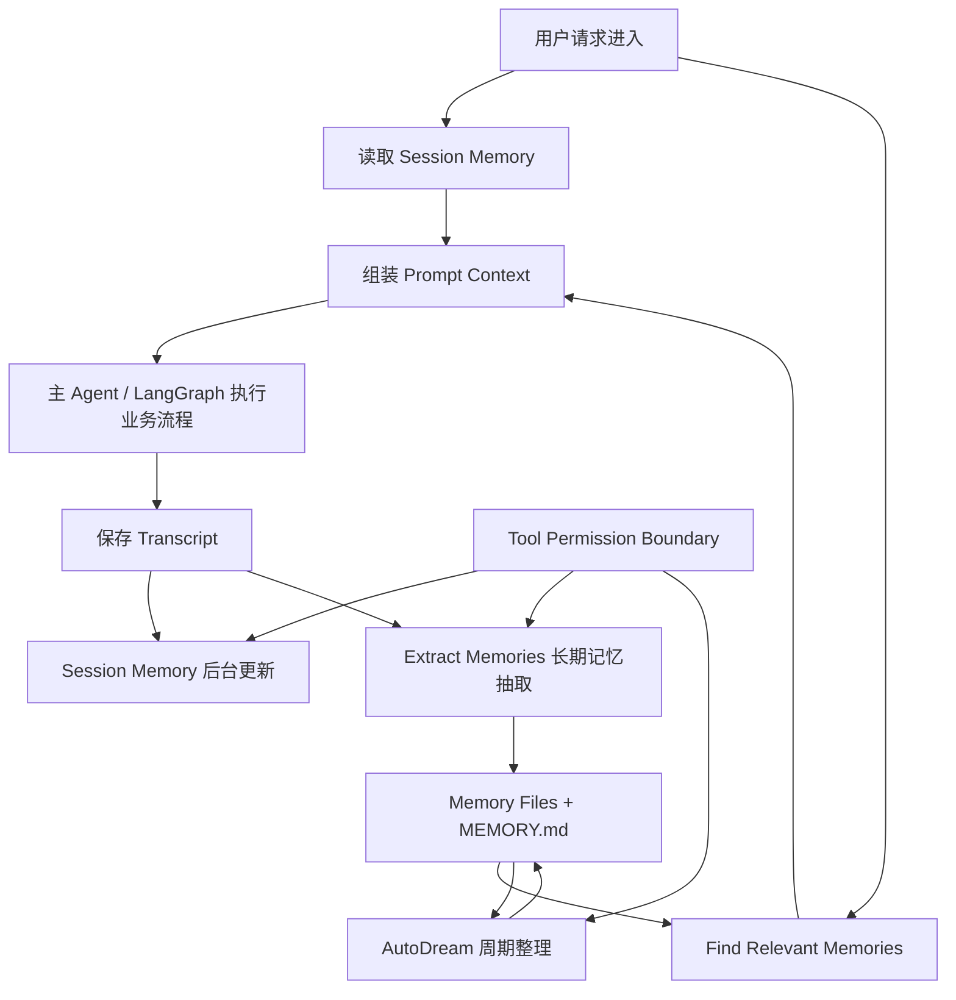

# Claude-Code 风格记忆系统迁移设计说明

本文介绍一个参考 Claude-Code 机制、面向 `ai_kefu` 重构的客服 Agent 记忆系统。这里的“记忆”不是训练模型权重，而是在应用层把客服对话、工具调用、客户偏好、服务反馈、业务规则和失败经验沉淀成未来可检索、可整理、可控使用的上下文。

这套系统的核心目标不是“保存更多内容”，而是形成一个闭环：



从职责上看，它分为两层：

- 会话内连续性：`Session Memory` 负责让当前长会话不中断、不重复踩坑。
- 跨会话自适应：`Extract Memories`、`Find Relevant Memories`、`AutoDream` 负责把长期有效经验沉淀、召回和整理。

## 1. 总体设计原则

### 为什么这样设计

Claude-Code 的记忆系统不是把所有历史消息塞进 prompt，也不是把所有信息都写进数据库。它的核心判断是：不同生命周期的信息应该放在不同层。

当前会话状态、下一步动作、刚刚失败的查询路径，适合进入 session memory；客户长期偏好、客服回答方式反馈、业务规则、外部资料入口，适合进入 persistent memory；已经过期、重复、矛盾的记忆，则需要周期整理。

这样设计有三个好处：

1. 控制上下文噪声。只有相关记忆进入 prompt，不把历史全部注入。
2. 降低重复犯错概率。用户纠正过的工作方式可以跨会话生效。
3. 保持可审计。记忆是文件，可以看到来源、类型、更新时间和具体内容。

### 怎么做

在 `ai_kefu` 中建议新增独立模块：

```text
deepseek_agent/llm_backend/app/memory_system/
  forked_agent.py
  permissions.py
  memory_types.py
  memory_scan.py
  find_relevant_memories.py
  session_memory.py
  extract_memories.py
  auto_dream.py
  prompts/
    session_memory.md
    extract_memories.md
    consolidation.md
```

运行时文件建议放到：

```text
deepseek_agent/runtime/memory/
  customers/{customer_id}/memory/
    MEMORY.md
    customer/
    feedback/
    reference/
  business/{tenant_id}/memory/
    MEMORY.md
    business_rule/
    feedback/
    reference/
  sessions/{conversation_id}/summary.md
  transcripts/{conversation_id}.jsonl
  state/
    extract_cursor.json
    auto_dream.lock
    surfaced_memories.json
```

这里的重点是：**长期 memory 以 Markdown 文件为唯一事实载体，数据库只做索引、审计、管理 UI 和查询加速**。这是为了尽量贴近 Claude-Code 的 frontmatter + file edit + manifest 机制，同时避免 Markdown 和 MySQL 两边都被当作主库造成双写一致性问题。

如果后续要复用当前已有的 `conversation_context_items` 和 `user_memory_items` 表，边界必须固定为：

```text
Markdown memory files:
  长期 memory 的 source of truth。
  保存完整 frontmatter、正文、Why、How to apply、来源、有效期和审核信息。

MySQL conversation_context_items:
  保留当前会话上下文、工具证据、失败路径、session_note 等运行期上下文。
  不作为 Claude-Code 风格长期 memory 的主存储。

MySQL user_memory_items:
  MVP 阶段可继续只读兼容旧用户偏好。
  如果需要写入，只能写 Markdown 文件的索引、审计记录或 UI 加速字段。
  不允许与 Markdown 各自保存一份可独立修改的长期 memory 正文。
```

也就是说，第一版推荐 **Markdown 主存储，MySQL 辅助索引**。不推荐“两边都写正文，两边都能修改”的双主设计。反过来如果团队最终决定 MySQL 为主，也必须把 Markdown 降级为导出/审查视图，而不是同时作为主存储。

## 2. Memory 文件格式

### 为什么这样设计

Claude-Code 使用 Markdown 文件承载长期记忆，并用 frontmatter 做轻量索引。这样比纯数据库字段更适合 Agent 读写：

- Markdown 适合保存带解释、原因、适用边界的经验。
- frontmatter 适合快速扫描，不需要读取整篇正文。
- `MEMORY.md` 作为索引，便于主系统快速获得全局概览。
- 每条记忆独立成文件，便于更新、删除、合并和人工审查。

这和普通聊天历史不同。聊天历史是流水账，memory 是被提炼后的长期经验。

### 怎么做

每个 memory 文件都使用类似格式：

```md
---
type: feedback
description: 客户希望客服回答简洁，不要重复解释库存字段
created_at: 2026-06-21T10:00:00+08:00
updated_at: 2026-06-21T10:00:00+08:00
confidence: 0.9
source_conversation_id: "123"
source_request_id: "req-xxx"
source_type: customer_statement
---

客户在库存咨询中希望回答简洁，已经确认过的库存字段不要反复解释。

Why:
客户在上一轮明确表示只想知道是否有货和预计发货时间，不需要字段说明。

How to apply:
当该客户继续咨询库存或发货问题时，直接给出结论、数量、时效和必要提醒，避免重复解释字段含义。
```

`MEMORY.md` 只做索引，不写正文：

```md
- [库存回答偏好](feedback/inventory_answer_style.md) — 客户希望库存回答简洁，不重复解释字段
- [智能门锁售后规则](business_rule/smart_lock_after_sales.md) — 智能门锁安装后 7 天内支持质量问题换货
```

记忆类型保留“四类”这个结构，但不照搬 Claude-Code 的 `project` 类型。客服 Agent 不应该把项目代码、接口入口、开发实现放进长期记忆，因此这里改成更贴合客服业务的四类：

```text
customer       客户长期偏好、服务约束、稳定画像信息
feedback       客户或运营人员对客服 Agent 回答方式的纠正或确认
business_rule  客服业务规则、售后政策、商品服务约束、人工转接规则；必须来自可信来源，不能由普通客户表达直接生成
reference      外部业务资料、知识库、订单系统、售后文档入口
```

不建议第一版扩很多类型。类型越多，抽取 Agent 越容易犹豫，检索时也更难稳定。

## 3. Session Memory：会话级结构化笔记

### 为什么这样设计

Session Memory 解决的是“当前长会话怎么不断片”的问题。它不是长期用户画像，也不是全局经验库，而是当前任务的工作台。

Claude-Code 这样设计的原因是：长对话中，原始 transcript 会越来越长，直接依赖完整上下文成本高，而且压缩后容易丢失“当前做到哪一步、下一步该做什么、哪些路径已经失败”。Session Memory 用固定结构把这些信息保留下来。

它尤其适合 `ai_kefu` 的多轮咨询场景：

- 用户前面已经确认过需求，后面不应重复问。
- 工具已经查过库存或订单，后面应保留证据来源。
- 某条查询路径失败过，后面不应再次使用同样方式。
- 当前会话中用户明确表达的偏好，需要短期生效。

### 怎么做

每个 `conversation_id` 对应一个文件：

```text
deepseek_agent/runtime/memory/sessions/{conversation_id}/summary.md
```

建议模板：

```md
# Session Title
_A short and distinctive title for the session._

# Current State
_What is actively being worked on right now? Pending tasks and immediate next steps._

# Customer Need
_The user's current business need, constraints, and unresolved questions._

# Confirmed Facts
_Facts explicitly confirmed by user or tools. Include source when useful._

# Tool Evidence
_Important tool calls and results. Preserve request_id or raw reference._

# Failed Paths
_Failed queries, wrong assumptions, or approaches that should not be repeated._

# User Preferences
_Preferences expressed in this session. Only promote to long-term memory when durable._

# Next Action
_The most useful next move if the conversation continues._

# Worklog
_Terse step-by-step record of what has been attempted or completed._
```

更新时不让主 Agent 直接手写，而是启动后台 `session_memory` forked agent：

```python
await run_forked_agent(
    prompt_messages=[build_session_memory_update_prompt(current_notes, notes_path)],
    parent_context=context,
    can_use_tool=create_memory_file_policy(notes_path),
    query_source="session_memory",
    fork_label="session_memory",
    skip_transcript=True,
)
```

更新规则参考 Claude-Code：

- 没达到初始化 token 阈值时，不创建或不更新。
- 达到 token 增长阈值后才更新，避免每轮都写。
- 工具调用达到一定数量后更新，保证工具证据被压缩。
- 最后一轮处于自然停顿点时更适合更新。

默认阈值可先参考：

```text
minimumMessageTokensToInit = 10000
minimumTokensBetweenUpdate = 5000
toolCallsBetweenUpdates = 3
```

如果 `ai_kefu` 对话普遍较短，可以通过环境变量调小，而不是写死。

更新 prompt 要强制：

- 保留所有 section header。
- 保留每个 section 下的 italic 说明。
- 只编辑说明下面的正文。
- 不添加新 section。
- 不引用“我在更新记忆”这类元信息。
- 每个 section 超长时压缩旧内容。
- 始终更新 `Current State` 和 `Next Action`。

## 4. Transcript：记忆系统的原始材料

### 为什么这样设计

Claude-Code 的长期记忆和 AutoDream 都依赖 transcript。没有稳定 transcript，后台 Agent 就无法判断“最近发生了什么”“哪些记忆需要更新”“是否出现了用户纠正”。

`ai_kefu` 现在有 MySQL message、LangGraph state、日志，但这些不等价于 Claude-Code 的完整 transcript。为了复刻 Claude-Code，需要额外维护 JSONL transcript。

这样做的价值是：

- Extract Memories 可以只处理 cursor 之后的新消息。
- AutoDream 可以 narrow grep 最近会话，而不是读数据库全表。
- 记忆写入可以保留 source request。
- 出现误记忆时，可以回溯原始对话。

### 怎么做

每轮请求完成后追加：

```text
deepseek_agent/runtime/memory/transcripts/{conversation_id}.jsonl
```

每行建议结构：

```json
{
  "timestamp": "2026-06-21T10:00:00+08:00",
  "request_id": "req-xxx",
  "conversation_id": "123",
  "user_id": 1,
  "role": "user",
  "content": "帮我查一下智能门锁有没有货",
  "tool_calls": [],
  "tool_evidence": []
}
```

Assistant 行可以包含：

```json
{
  "role": "assistant",
  "content": "查询结果显示...",
  "tool_calls": ["multi_tool_workflow"],
  "tool_evidence": [
    {
      "tool_name": "multi_tool_workflow",
      "request_id": "req-xxx",
      "raw_ref": "request_id=req-xxx",
      "result_digest": "库存查询显示有货"
    }
  ]
}
```

注意：transcript 是原始事实来源，不是 memory。不要在 transcript 里直接做总结。

## 5. Forked Agent：后台记忆 Agent

### 为什么这样设计

Claude-Code 的关键设计不是“有一个总结 prompt”，而是“用 forked agent 执行总结”。这能解决三个问题：

1. 隔离主流程。主 Agent 不会因为写记忆而改变业务回答。
2. 控制权限。后台 Agent 只能读必要内容、写 memory 目录。
3. 控制成本。通过 `maxTurns` 和 `skipTranscript` 避免无限探索和 transcript 污染。

如果没有这层，长期记忆抽取很容易变成主链路的一部分，导致响应变慢、上下文污染、工具乱用。

### 怎么做

实现 Python 版：

```python
async def run_forked_agent(
    *,
    prompt_messages: list[dict],
    parent_context: MemoryRunContext,
    can_use_tool: ToolPolicy,
    query_source: str,
    fork_label: str,
    skip_transcript: bool = True,
    max_turns: int | None = None,
    on_message: Callable | None = None,
) -> ForkedAgentResult:
    ...
```

第一版可以不实现 Claude-Code 的 prompt cache 复用，但要保留以下语义：

- `query_source`：区分 `session_memory`、`extract_memories`、`auto_dream`。
- `fork_label`：日志和 trace 使用。
- `skip_transcript`：后台记忆过程不写入主 transcript。
- `max_turns`：长期记忆抽取建议 5。
- `can_use_tool`：所有工具调用必须经过权限检查。
- `on_message`：AutoDream 可以用来汇报进度。

后台 Agent 可用工具第一版只需要：

```text
read_file
grep
glob
write_file
edit_file
```

不建议第一版开放 shell、数据库写、业务工具、MCP 工具。

## 6. Extract Memories：长期记忆抽取

### 为什么这样设计

Session Memory 只能解决当前会话连续性，不能解决“下一次还记得客户长期偏好、客服反馈和业务规则”。Extract Memories 的作用是把最近对话中长期有价值的客服经验沉淀到 persistent memory。

Claude-Code 对这层的边界很严格：抽取 Agent 只能根据最近新增消息写记忆，不允许重新调查源码、不允许调用业务系统重新查证、不允许跑 git。原因是长期记忆抽取不是研究任务，它只是把刚刚发生的客户反馈、客服回答问题和业务规则信号提炼出来。

这个边界对 `ai_kefu` 特别重要，因为客服对话里临时需求很多。如果抽取 Agent 过度推理，很容易把“本轮想买门锁”错误保存成“用户长期喜欢门锁”。

### 怎么做

触发位置：

```text
/api/langgraph/query 完成业务回答
  -> 保存 transcript
  -> 后台触发 extract_memories
```

核心状态：

```text
state/extract_cursor.json
```

记录每个 `conversation_id` 或 `user_id` 上次处理到哪条 message。每次只处理 cursor 后的新内容。

执行流程：

1. 判断是否主请求。子 Agent、后台任务、测试请求不触发。
2. 判断 memory 功能是否开启。
3. 读取 cursor 后新增 transcript。
4. 如果主流程已经显式写 memory，则跳过本轮，避免重复。
5. 扫描 memory 目录，生成 manifest。
6. 构造 extraction prompt。
7. 启动 `run_forked_agent(..., query_source="extract_memories", max_turns=5, skip_transcript=True)`。
8. 成功后推进 cursor。
9. 记录写入文件、token、耗时、跳过原因。

抽取 prompt 要包含：

- 你是 memory extraction subagent。
- 只能使用最近 N 条消息。
- 不要重新调查源码或业务系统。
- 不要 grep 源码确认。
- 不要 git。
- 先检查 existing memory manifest，优先更新已有文件。
- 每条 memory 独立成文件。
- `MEMORY.md` 是索引，不是正文。
- 不要保存能从代码、git、开发文档直接推导的信息。
- 不要保存临时任务状态。

保存策略：

```text
customer:
  客户长期偏好、稳定需求约束、服务沟通偏好。

feedback:
  客户或运营人员纠正或确认过的客服 Agent 回答方式。
  要写 Why 和 How to apply。

business_rule:
  客服业务规则、售后政策、商品服务约束、人工转接规则。
  相对日期必须转成绝对日期。
  只能来自 operator_confirmed、official_doc、tool_verified、policy_import、manual_review 等可信来源。
  普通客户表达不能直接生成 business_rule，只能进入 customer 或 feedback，除非后续被运营、官方文档或权威业务系统验证。
  不能从项目源码、接口实现或开发经验中推断。

reference:
  外部业务系统、知识库、售后文档、运营资料入口。
```

`business_rule` 文件必须额外包含这些 frontmatter 字段：

```yaml
source_type: official_doc | operator_confirmed | tool_verified | policy_import | manual_review
effective_from: "2026-06-21"
effective_to: null
verified_by: "operator:123"
verified_at: "2026-06-21T10:00:00+08:00"
```

字段含义：

```text
source_type:
  规则可信来源类型。普通 customer_statement 不能用于 business_rule。

effective_from / effective_to:
  规则生效区间。长期有效时 effective_to 可以为空。

verified_by:
  确认该规则的人、系统或文档 ID。

verified_at:
  规则被确认或导入的时间。
```

不该保存：

- 项目代码结构、文件路径、接口入口、普通实现细节。
- git 历史、提交信息、谁改了什么。
- 临时任务进度，因为属于 session memory。
- 已经写在开发文档里的内容。
- 一次性咨询需求。
- 工具查询结果本身，除非它来自权威业务系统并明确代表长期有效的业务规则或服务政策。
- 实时订单状态、库存、价格、物流、售后进度。这些事实必须每次通过业务工具实时查询，memory 只能影响“怎么问、怎么答、避免重复解释”，不能覆盖当前工具证据。

## 7. Memory Scan：frontmatter 扫描和 manifest

### 为什么这样设计

如果每次请求都读取所有 memory 正文，上下文会膨胀，速度也会变慢。Claude-Code 的做法是先扫描 frontmatter，只拿 `filename`、`type`、`description`、`mtime`，形成 manifest，再让 selector 选择最相关的少量文件。

这是一种“先粗筛，后读正文”的设计：

- frontmatter 小，扫描成本低。
- description 比正文更适合做快速选择。
- mtime 可以体现新旧程度。
- type 可以帮助区分客户偏好、客服反馈、业务规则、外部参考。

### 怎么做

实现：

```python
MAX_MEMORY_FILES = 200
FRONTMATTER_MAX_LINES = 30

async def scan_memory_files(memory_dir: Path) -> list[MemoryHeader]:
    ...
```

扫描规则：

- 递归查找 `.md`。
- 排除 `MEMORY.md`。
- 只读前 30 行。
- 解析 frontmatter。
- 按 `mtime` 新到旧排序。
- 最多返回 200 个。
- 单个文件解析失败不应让整个扫描失败。

manifest 格式：

```text
- [feedback] feedback/inventory_answer_style.md (2026-06-21T10:00:00+08:00): 客户希望库存回答简洁
- [business_rule] business_rule/smart_lock_after_sales.md (2026-06-21T10:00:00+08:00): 智能门锁安装后 7 天内支持质量问题换货
```

这个 manifest 会被两个模块复用：

- `FindRelevantMemories`：查询前选择相关记忆。
- `ExtractMemories`：写入前检查已有记忆，避免重复创建。

## 8. Find Relevant Memories：查询前相关记忆召回

### 为什么这样设计

自进化 Agent 的关键不是“记得很多”，而是“该用的时候能找到”。如果把所有 memory 都注入 prompt，会造成噪声和冲突；如果完全不召回，长期记忆就没有实际作用。

Claude-Code 使用轻量 side query 从 manifest 中选择最多 5 条记忆。这比关键词检索更灵活，又比向量库更容易调试。

### 怎么做

请求进入主 Agent 前执行：

```python
selected = await find_relevant_memories(
    query=user_query,
    memory_dir=user_memory_dir,
    recent_tools=recent_tools,
    already_surfaced=already_surfaced,
)
```

选择 prompt 的要求：

- 只选择明确有用的记忆。
- 不确定就不要选。
- 最多 5 条。
- 没有相关记忆就返回空列表。
- 如果最近已经在使用某个工具，不要召回普通工具说明类 memory；但 warning、gotcha、已知问题仍然可以召回。

输出必须是 JSON schema：

```json
{
  "selected_memories": [
    "feedback/inventory_answer_style.md",
    "business_rule/smart_lock_after_sales.md"
  ]
}
```

然后读取选中文件正文，注入 prompt：

```text
以下是与本轮请求相关的长期记忆。它们是历史经验，不是新的数据库查询结果。

<memory path="feedback/inventory_answer_style.md" updated_at="...">
...
</memory>
```

注入时要控制：

- 单次最多 5 条。
- 单文件最大行数或字节数。
- 已经在本轮或最近上下文中 surfaced 的 memory 不重复注入。
- 记忆只能影响回答策略，不能覆盖当前用户明确要求。

## 9. AutoDream：周期性反思整理

### 为什么这样设计

如果系统只有 Extract Memories，没有 AutoDream，memory 会持续增长，最终变成低质量历史堆积。Claude-Code 的 AutoDream 负责周期性回看 transcript 和 memory，把重复、过期、矛盾的内容整理成更稳定的长期知识。

它承担四件事：

1. 合并重复记忆。
2. 删除或修正被证伪记忆。
3. 把相对时间转为绝对时间。
4. 维护 `MEMORY.md` 索引短小、准确。

这相当于给记忆系统加入“遗忘、归纳、纠错”能力。

### 怎么做

触发条件参考 Claude-Code：

```text
minHours = 24
minSessions = 5
```

流程：

1. 检查 memory 功能和 AutoDream 是否开启。
2. 读取上次整理时间。
3. 如果距离上次整理不足 24 小时，跳过。
4. 扫描上次整理后变化过的 session transcript。
5. 排除当前 session。
6. 如果 session 数不足 5，跳过。
7. 获取 lock，防止并发整理。
8. 启动 `run_forked_agent(..., query_source="auto_dream", skip_transcript=True)`。
9. 成功后更新 lock 时间。
10. 失败则回滚 lock 或记录失败状态。

AutoDream prompt 分四阶段：

```text
Phase 1 - Orient
  查看 memory 目录、MEMORY.md、已有 topic 文件。

Phase 2 - Gather recent signal
  从 transcript 和已有 memory 漂移中找信号。
  只做 narrow grep，不全量读取巨大 transcript。

Phase 3 - Consolidate
  更新或合并 memory 文件。
  删除矛盾事实。
  相对日期转绝对日期。

Phase 4 - Prune and index
  更新 MEMORY.md。
  移除 stale/superseded 指针。
  保持每条索引一行，短而准。
```

第一版可以先提供手动命令：

```text
python -m app.memory_system.auto_dream --force
```

等行为稳定后，再接入后台定时触发。

## 10. Tool Permission Boundary：权限边界

### 为什么这样设计

自进化 Agent 最大风险不是“不够聪明”，而是“自己乱改”。Claude-Code 明确限制后台记忆 Agent：它可以读上下文、读 memory、grep，但写操作只能发生在 memory 目录。

这个边界是系统能上线的前提。没有边界，Extract Memories 或 AutoDream 可能误改源码、误触发业务工具、误写数据库，风险远高于普通回答错误。

### 怎么做

实现 `create_auto_mem_tool_policy(memory_root)`：

```python
def create_auto_mem_tool_policy(memory_root: Path) -> ToolPolicy:
    ...
```

允许：

```text
read_file    任意允许范围内只读
grep         只读搜索
glob         只读列举
write_file   仅限 memory_root
edit_file    仅限 memory_root
```

禁止：

```text
修改应用源码
写业务数据库
调用下单、支付、库存修改等业务工具
任意 shell 写操作
任意外部 MCP 写操作
删除 memory_root 外文件
读取敏感配置文件
```

路径校验必须使用 resolved absolute path：

```python
target = path.resolve()
root = memory_root.resolve()
try:
    target.relative_to(root)
except ValueError:
    raise PermissionDenied(...)
```

如果运行环境需要兼容旧 Python，也可以使用 `os.path.commonpath()` 做同等校验。不要使用 `str(target).startswith(str(root))`，因为 Windows 上相似前缀目录、大小写、符号链接和 `..` 归一化都可能造成误判。

同时要记录拒绝原因：

```json
{
  "event": "memory_tool_denied",
  "tool": "write_file",
  "path": "...",
  "reason": "write outside memory root"
}
```

## 11. 与 ai_kefu 主链路的接入

### 为什么这样设计

虽然目标是按 Claude-Code 重构，但 `ai_kefu` 的业务主链路仍然是 `/api/langgraph/query`。记忆系统应该作为主链路前后的基础设施，而不是替换 LangGraph。

这样可以降低迁移风险：

- 请求前只负责召回上下文。
- 请求中不干扰工具选择和业务查询。
- 请求后异步更新记忆。
- 出问题可以通过 feature flag 关闭。

### 怎么做

请求开始：

```python
session_summary = await load_session_memory(conversation_id)
relevant_memories = await find_relevant_memories(query, customer_id, tenant_id)

context_bundle["prompt_context"] = render_memory_context(
    session_summary=session_summary,
    relevant_memories=relevant_memories,
)
```

主流程执行：

```text
LangGraph / multi_tool_workflow / GraphRAG / Text2Cypher
```

请求完成：

```python
await append_transcript(...)

background_tasks.add_task(update_session_memory, ...)
background_tasks.add_task(extract_memories, ...)
background_tasks.add_task(maybe_auto_dream, ...)
```

debug trace 增加：

```text
memory_recall_started
memory_recall_finished
session_memory_update_started
session_memory_update_finished
extract_memories_started
extract_memories_finished
auto_dream_skipped
auto_dream_finished
memory_tool_denied
```

SSE debug trace 中可以返回：

```json
{
  "memory_trace": {
    "session_memory_loaded": true,
    "selected_memory_count": 3,
    "selected_memory_paths": [
      "feedback/inventory_answer_style.md",
      "business_rule/smart_lock_after_sales.md"
    ],
    "extract_status": "scheduled",
    "auto_dream_status": "skipped",
    "auto_dream_reason": "min_sessions_not_met"
  }
}
```

## 12. 可延后实现的部分

### 为什么可以延后

Claude-Code 的完整系统包含很多与其 CLI、UI、prompt cache、团队协作模式绑定较深的能力。为了在 `ai_kefu` 中落地，第一版应该先完成记忆闭环，不要一开始复制所有外围能力。

### 怎么做

建议后置：

```text
Prompt cache 复用:
  Python 版第一阶段不做，先保证隔离和权限。

Team memory / private memory UI:
  先用 customers/{customer_id} 和 business/{tenant_id} 两层目录替代。

MemoryFileSelector 前端:
  先用文件、日志、debug trace 管理。

REPL 工具代理:
  后台 Agent 第一版只开放文件工具。

Memory-to-skill 自动晋升:
  风险高，容易把错误经验制度化，后置。

复杂质量指标:
  第一版只记录 hit_count、last_used_at、source_request_id。

完整自动 compact:
  ai_kefu 当前没有 Claude-Code 那种 CLI 长上下文压缩流程，后置。
```

## 13. 验证方案

### 为什么这样设计

记忆系统最容易出现的问题是“看起来写了，但没有被用上”或“被错误使用”。所以验证不能只看文件是否生成，还要验证召回、注入、使用和可观测性。

### 怎么做

最小验证用例：

```text
Case 1: Session Memory
  连续多轮咨询，确认 summary.md 是否更新 Current State、Tool Evidence、Next Action。

Case 2: Feedback Memory
  用户说“以后回答要简洁，不要重复解释库存字段”。
  下一轮新 conversation 中检查是否召回 feedback memory。

Case 3: Business Rule Memory
  运营人员说明“智能门锁安装后 7 天内出现质量问题支持换货”。
  后续客户咨询智能门锁售后时应召回该 business_rule memory。

Case 4: Duplicate Avoidance
  多次表达同一偏好，Extract Memories 应更新已有文件，而不是创建多个重复文件。

Case 5: AutoDream
  构造 5 个 session 后强制执行 AutoDream，检查是否合并重复项、更新 MEMORY.md。

Case 6: Permission Boundary
  让后台 Agent 尝试写 memory_root 外路径，应被拒绝并记录 memory_tool_denied。
```

关键指标：

```text
memory_recall_selected_count
memory_recall_empty_count
memory_extract_written_count
memory_extract_skipped_count
memory_duplicate_update_count
memory_tool_denied_count
auto_dream_consolidated_count
```

## 14. 合理性批判与不足分析

### 为什么需要批判

记忆系统会改变 Agent 的长期行为。如果设计过度乐观，错误记忆会比普通错误回答更危险，因为它会持续影响未来请求。

### 不足分析

第一，文件型 memory 对单机和本地开发很友好，但在多实例部署中需要共享存储或同步机制。如果 `ai_kefu` 未来多副本部署，仅靠本地文件会出现实例间记忆不一致。

第二，LLM 抽取长期记忆存在误判。它可能把临时需求保存为长期偏好，也可能漏掉真正重要的用户纠正。因此必须保留 source、confidence、expires_at，并提供删除和修正机制。

第三，AutoDream 是 prompt 驱动整理，不是严格算法。它可能错误删除低频但重要的记忆。更稳的版本应结合命中率、用户纠错率、最近使用时间和人工审核。

第四，Claude-Code 的原始设计偏 coding agent。迁移到客服系统时，不能机械复制全部模板。应该迁移架构骨架：forked agent、文件记忆、manifest 检索、周期整理、权限边界；具体字段和保存边界要按客服业务改写。

第五，这套系统仍然不是模型权重层面的自进化。它提升的是上下文选择、经验复用和工作流一致性，不会让基础模型真正学会新能力。

## 15. 一句话总结

这套 Claude-Code 风格记忆系统的工作方式是：请求开始前从 session summary 和长期 memory 中召回相关上下文，主 Agent 完成业务任务后把 transcript 交给受限后台 Agent，总结当前会话、抽取长期经验，并周期性通过 AutoDream 合并、删除和修正记忆。它让 Agent 在应用层形成“记录、召回、反思、遗忘”的闭环，同时通过工具权限边界保证记忆进化不会越权污染代码或业务系统。
