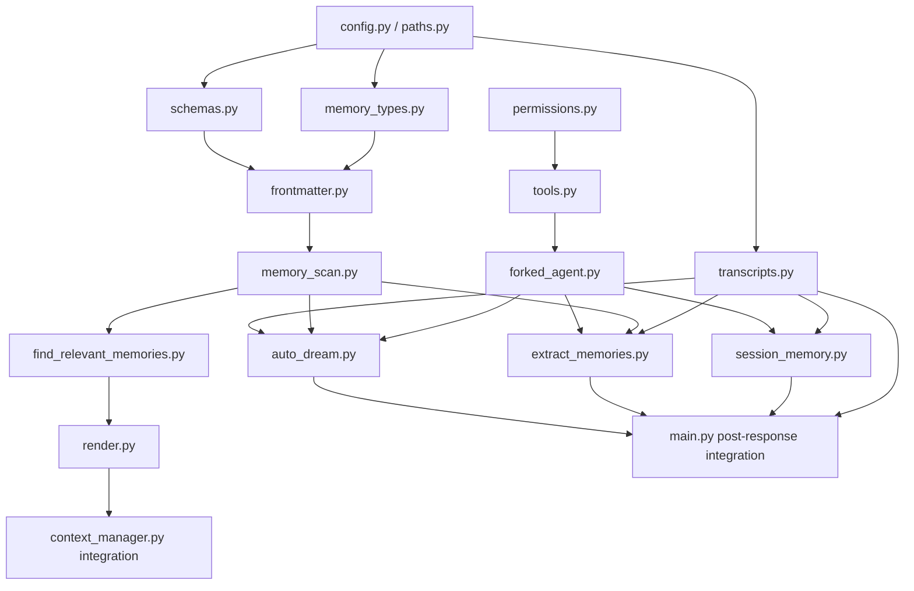

# 2. 总体实施路线

本文是 `ai_kefu` Claude-Code 风格记忆系统实施计划第 2 个文件，说明从 MVP 到完整版本的阶段拆分、每阶段依赖关系、推荐提交顺序和整体验收方式。

## 2.1 总体原则

### 阶段目标

用多阶段方式把 Claude-Code 风格记忆系统接入 `ai_kefu`，避免一次性大改主业务链路。

总体路线：

```text
先建立类型、路径、扫描、transcript 等不可变基础
再做查询前召回
再做 session memory
再做长期 memory 抽取
再补 forked agent 和权限边界
最后接入 AutoDream、debug trace 和主接口全链路
```

### 为什么这样安排

记忆系统不是一个单点函数，而是一组协作模块：

```text
memory_types
paths/config
frontmatter
memory_scan
find_relevant_memories
transcripts
session_memory
extract_memories
forked_agent
permissions
auto_dream
render/debug_trace
/api/langgraph/query integration
```

如果先写 `extract_memories.py`，但没有类型、路径、frontmatter、权限和 transcript，就会变成一个不可测试的 LLM prompt。相反，先把文件结构和扫描能力做实，可以在没有 LLM 的情况下完成大量确定性验证。

## 2.2 13 个计划文件对应关系

本实施计划拆成 13 个 Markdown 文件：

```text
01-current-premises-and-boundaries.md
02-overall-implementation-route.md
03-phase-1-memory-types-and-file-structure.md
04-phase-2-memory-scan-and-manifest.md
05-phase-3-transcript-jsonl.md
06-phase-4-find-relevant-memories.md
07-phase-5-session-memory.md
08-phase-6-extract-memories.md
09-phase-7-forked-agent-and-permissions.md
10-phase-8-auto-dream.md
11-phase-9-langgraph-query-and-debug-trace.md
12-test-plan.md
13-milestones-risks-simplifications.md
```

当前先完成 01-04。后续文件应延续相同粒度：每个阶段都包含目标、先做原因、文件变更、职责、关键函数、数据结构、接入点、验证方式、风险和暂缓项。

## 2.3 Phase 总览

### Phase 1: 基础文件结构和 Memory 类型

目标：

```text
建立 memory_system 包
定义 memory type
定义路径和配置
定义 frontmatter/schema
生成 runtime memory 目录结构
提供不依赖 LLM 的单元测试
```

先做原因：

```text
所有后续模块都依赖 MemoryType、MemoryHeader、MemoryScope、路径解析和 feature flag。
如果类型边界没定，后面的 prompt 和扫描都会不稳定。
```

核心产出：

```text
app/memory_system/memory_types.py
app/memory_system/config.py
app/memory_system/paths.py
app/memory_system/schemas.py
app/memory_system/frontmatter.py
tests for type parsing and path resolving
```

完成标准：

```text
pytest 通过 memory_types/paths/frontmatter 测试
创建 runtime memory 目录不影响旧系统
MemoryType 中没有 project
非法类型能明确报错或降级为 invalid scan item
```

### Phase 2: Memory Scan 和 Manifest

目标：

```text
实现 frontmatter 浅扫描
格式化 manifest
支持 customer/business 两层 memory root
为后续 recall 和 extract 复用扫描结果
```

先做原因：

```text
findRelevantMemories 和 extractMemories 都要先知道有哪些 memory。
扫描是低风险、确定性、可单测的基础模块。
```

核心产出：

```text
app/memory_system/memory_scan.py
scan_memory_files()
format_memory_manifest()
scan_memory_roots()
```

完成标准：

```text
只读前 30 行 frontmatter
排除 MEMORY.md
最多返回 200 个
mtime 新到旧排序
坏文件不导致整体失败，但记录 skipped reason
```

### Phase 3: Transcript JSONL

目标：

```text
把主请求的 user/assistant/tool evidence 写入 JSONL transcript
为 SessionMemory、ExtractMemories、AutoDream 提供原始材料
```

先做原因：

```text
没有 transcript，后台抽取只能依赖主链路临时变量，无法 cursor 增量处理，也无法追溯误记忆来源。
```

核心产出：

```text
app/memory_system/transcripts.py
append_transcript_event()
append_turn_transcript()
read_transcript_since_cursor()
update_extract_cursor()
```

完成标准：

```text
每轮 /api/langgraph/query 可生成 JSONL
JSONL 每行可独立 json.loads
后台记忆任务不写入主 transcript
包含 request_id、conversation_id、user_id、role、content_digest/tool_evidence
```

### Phase 4: FindRelevantMemories 查询前召回

目标：

```text
请求进入 LangGraph 前，根据用户 query 从 manifest 中选出最多 5 条 memory，并渲染进 prompt_context。
```

先做原因：

```text
这是长期 memory 对主 Agent 产生价值的第一个闭环。
它只依赖 Phase 1-2，可以先用手工构造 memory 文件验证，不必等待 ExtractMemories。
```

核心产出：

```text
app/memory_system/find_relevant_memories.py
app/memory_system/render.py
find_relevant_memories()
select_relevant_memories()
render_memory_context()
```

完成标准：

```text
没有 memory 时返回空
LLM selector 输出必须符合 selected_memories schema
非法路径被过滤
最多注入 5 条
debug trace 能看到 selected_memory_paths
```

### Phase 5: SessionMemory 会话记忆

目标：

```text
实现文件型 session summary.md，记录当前会话状态、客户需求、工具证据、失败路径和下一步动作。
```

先做原因：

```text
SessionMemory 只影响当前 conversation，风险低于长期 memory 抽取。
它可以先与旧 DB 型 session_note 并行，不破坏现有功能。
```

核心产出：

```text
app/memory_system/session_memory.py
prompts/session_memory.md
sessions/{conversation_id}/summary.md
```

完成标准：

```text
达到阈值后生成 summary.md
未达到阈值时明确 skipped reason
debug trace 可观察 update_started/update_finished
后台过程不写入主 transcript
```

### Phase 6: ExtractMemories 长期记忆抽取

目标：

```text
根据 transcript 新增内容抽取 customer/feedback/business_rule/reference 长期 memory。
```

先做原因：

```text
当 recall、scan、transcript 都稳定后，长期抽取才有可靠输入和输出位置。
```

核心产出：

```text
app/memory_system/extract_memories.py
prompts/extract_memories.md
state/extract_cursor.json
```

完成标准：

```text
能从用户纠正中生成 feedback memory
能从明确政策中生成 business_rule memory
不会生成 project memory
重复内容优先更新已有文件
cursor 成功推进
```

### Phase 7: ForkedAgent 和权限边界

目标：

```text
把 SessionMemory、ExtractMemories、AutoDream 的后台 LLM 工作放入受限 forked agent。
```

先做原因：

```text
MVP 可先直接服务端写文件，但要上线长期自动写入前，必须补权限边界。
```

核心产出：

```text
app/memory_system/forked_agent.py
app/memory_system/permissions.py
app/memory_system/tools.py
```

完成标准：

```text
写 memory_root 外路径会被拒绝
拒绝事件写入 memory_tool_denied
后台任务 skip_transcript=true
max_turns 生效
```

### Phase 8: AutoDream 周期整理

目标：

```text
按 24 小时和 5 个 session 阈值整理重复、过期、冲突 memory。
```

先做原因：

```text
只有长期 memory 抽取积累了一段时间后，AutoDream 才有整理价值。
```

核心产出：

```text
app/memory_system/auto_dream.py
prompts/consolidation.md
state/auto_dream.lock
state/auto_dream_state.json
```

完成标准：

```text
--force 手动运行可整理 fixture memory
默认阈值不足时跳过并记录 reason
lock 防止并发运行
MEMORY.md 被更新为短索引
```

### Phase 9: 接入 /api/langgraph/query 和 debug trace

目标：

```text
把 recall、transcript、session update、extract、autoDream 串进 /api/langgraph/query。
```

先做原因：

```text
各子模块都可单独测试后，最后做主链路接入，风险最小。
```

核心产出：

```text
deepseek_agent/llm_backend/main.py
deepseek_agent/llm_backend/app/lg_agent/context_manager.py
deepseek_agent/llm_backend/app/lg_agent/lg_builder.py 可选小改
debug_trace/memory_trace 字段
```

完成标准：

```text
feature flag 关闭时行为与旧系统一致
feature flag 开启时可看到 memory_trace
主回答内容不包含后台抽取过程
SSE trace 能看到 recall/transcript/extract 状态
```

## 2.4 模块依赖图



## 2.5 推荐目录结构

第一阶段先新增：

```text
deepseek_agent/llm_backend/app/memory_system/
  __init__.py
  config.py
  paths.py
  memory_types.py
  schemas.py
  frontmatter.py
```

第二阶段新增：

```text
deepseek_agent/llm_backend/app/memory_system/
  memory_scan.py
```

第三阶段新增：

```text
deepseek_agent/llm_backend/app/memory_system/
  transcripts.py
```

第四阶段新增：

```text
deepseek_agent/llm_backend/app/memory_system/
  find_relevant_memories.py
  render.py
```

第五到第八阶段新增：

```text
deepseek_agent/llm_backend/app/memory_system/
  session_memory.py
  extract_memories.py
  forked_agent.py
  permissions.py
  tools.py
  auto_dream.py
  prompts/
    session_memory.md
    extract_memories.md
    consolidation.md
```

测试目录：

```text
deepseek_agent/llm_backend/app/test/test_memory_types.py
deepseek_agent/llm_backend/app/test/test_memory_paths.py
deepseek_agent/llm_backend/app/test/test_frontmatter.py
deepseek_agent/llm_backend/app/test/test_memory_scan.py
deepseek_agent/llm_backend/app/test/test_transcripts.py
deepseek_agent/llm_backend/app/test/test_find_relevant_memories.py
deepseek_agent/llm_backend/app/test/test_session_memory.py
deepseek_agent/llm_backend/app/test/test_extract_memories.py
deepseek_agent/llm_backend/app/test/test_permissions.py
deepseek_agent/llm_backend/app/test/test_auto_dream.py
```

## 2.6 推荐 PR / commit 顺序

### Commit 1: Memory package skeleton

包含：

```text
memory_system/__init__.py
config.py
paths.py
memory_types.py
schemas.py
frontmatter.py
基础单元测试
```

不包含：

```text
main.py 修改
LLM 调用
后台任务
```

验证：

```text
deepseek_agent/.venv/python.exe -m pytest deepseek_agent/llm_backend/app/test/test_memory_types.py
deepseek_agent/.venv/python.exe -m pytest deepseek_agent/llm_backend/app/test/test_memory_paths.py
```

### Commit 2: Memory scan and manifest

包含：

```text
memory_scan.py
frontmatter fixture
manifest formatting tests
```

验证：

```text
deepseek_agent/.venv/python.exe -m pytest deepseek_agent/llm_backend/app/test/test_memory_scan.py
```

### Commit 3: Transcript JSONL

包含：

```text
transcripts.py
JSONL append/read/cursor tests
```

验证：

```text
deepseek_agent/.venv/python.exe -m pytest deepseek_agent/llm_backend/app/test/test_transcripts.py
```

### Commit 4: Recall without main integration

包含：

```text
find_relevant_memories.py
render.py
selector mock tests
```

验证：

```text
deepseek_agent/.venv/python.exe -m pytest deepseek_agent/llm_backend/app/test/test_find_relevant_memories.py
```

### Commit 5: Recall integration behind feature flag

包含：

```text
context_manager.py 小范围接入
memory_trace 字段
```

验证：

```text
feature flag off: 旧 test_context_manager.py 继续通过
feature flag on: 手工 memory 文件可被召回
```

### Commit 6: File SessionMemory

包含：

```text
session_memory.py
prompts/session_memory.md
summary.md 读写
```

验证：

```text
达到阈值生成 summary.md
debug trace 能看见 session_memory_update_finished
```

### Commit 7: Transcript integration

包含：

```text
main.py 请求完成后 append_transcript
```

验证：

```text
/api/langgraph/query 一轮请求后生成 transcripts/{conversation_id}.jsonl
JSONL 不包含后台 memory agent 内容
```

### Commit 8: ExtractMemories MVP

包含：

```text
extract_memories.py
prompts/extract_memories.md
cursor
server-side deterministic writer or LLM JSON writer
business_rule 可信来源校验
实时事实拒绝写入校验
```

验证：

```text
构造 transcript 后生成 feedback/customer/business_rule/reference memory
重复记忆不重复创建
普通客户一句“应该七天退”不会生成 business_rule
订单/库存/价格/物流/售后进度不会写入长期 memory
```

### Commit 9: ForkedAgent + permissions

包含：

```text
forked_agent.py
permissions.py
tools.py
```

验证：

```text
写 memory_root 外路径被拒绝
memory_tool_denied 日志存在
```

### Commit 10: AutoDream manual

包含：

```text
auto_dream.py
consolidation prompt
manual --force
lock/state
```

验证：

```text
fixture memory 可合并
阈值不足时 skipped reason 正确
```

### Commit 11: Full /api/langgraph/query integration

包含：

```text
main.py
context_manager.py
memory_trace/debug_trace
background scheduling
```

验证：

```text
SSE trace 可观察完整 memory_trace
主对话没有后台任务污染
feature flag off 完全禁用
```

### Commit 12: End-to-end tests and docs

包含：

```text
端到端手工 case
README 或 docs 更新
风险和运维说明
```

验证：

```text
pytest memory_system 全部通过
手工 /api/langgraph/query case 通过
```

## 2.7 每阶段统一完成标准

每个阶段都必须满足：

```text
1. 有对应单元测试或手动验证 case
2. feature flag 默认不影响旧链路
3. 日志有 started/finished/skipped/failed 中至少两个状态
4. 错误不被无声吞掉，必须记录 reason/error_type
5. 不引入 project memory type
6. 不让后台记忆任务写入主 transcript
7. 不要求开发者运行 init_db.py
```

## 2.8 接入点分层

### 上下文准备层

文件：

```text
deepseek_agent/llm_backend/app/lg_agent/context_manager.py
```

职责：

```text
加载旧 DB 上下文
加载文件型 session memory
调用 find_relevant_memories
渲染 prompt_context
准备 memory_trace 摘要
```

注意：

```text
不应在这里写 transcript
不应在这里触发 ExtractMemories
不应在这里修改业务工具选择逻辑
```

### 主请求完成层

文件：

```text
deepseek_agent/llm_backend/main.py
```

职责：

```text
拿到 final_answer 和 tool_evidence
保存 MySQL message
保存 tool_evidence
append transcript
调度 session memory update
调度 extract memories
调度 maybe auto dream
输出 debug trace
```

注意：

```text
debug_trace=True 时可以同步等待部分 memory 结果
debug_trace=False 时应 background_tasks 异步执行
```

### Prompt 注入层

文件：

```text
deepseek_agent/llm_backend/app/lg_agent/lg_builder.py
```

职责：

```text
继续读取 context_bundle["prompt_context"]
把上下文作为 system message 插入
```

原则：

```text
尽量不改这个文件。
如果 prompt_context 已经在 context_manager.py 拼好，lg_builder.py 可以不动。
```

## 2.9 MVP 与增强版划分

### MVP 必须包含

```text
memory_system 包结构
MemoryType 四类型
Markdown 作为长期 memory source of truth 的边界
MySQL 只做索引、审计、管理 UI、查询加速和旧数据兼容
路径解析和目录初始化
frontmatter 解析
memory scan
manifest formatting
transcript JSONL
findRelevantMemories 可 mock selector
prompt_context 渲染
feature flag
基础 memory_trace
```

### MVP 可以简化

```text
FindRelevantMemories 的 selector 可以先支持 mock/deterministic，再接 LLM。
ExtractMemories 可以先返回 LLM JSON，由服务端验证后写文件。
ForkedAgent 可以先定义接口，后续替换直接调用。
AutoDream 可以先只做手动 --force。
tenant_id 可以先 default。
customer_id 可以先映射 user_id。
```

### MVP 不能简化

```text
MemoryType 不能包含 project。
不能让 Markdown 和 MySQL 同时作为长期 memory 主库。
business_rule 必须校验 source_type/effective_from/effective_to/verified_by/verified_at。
普通客户表达不能直接生成 business_rule。
订单、库存、价格、物流、售后进度必须实时查询，不能被 memory 替代。
后台写文件不能越过 memory root。
transcript 必须区分主对话和后台任务。
长期 memory 不能保存订单实时状态。
feature flag 必须能关闭。
相对日期进入长期 memory 前必须有绝对日期。
```

## 2.10 风险和不足分析

### 分阶段会让短期系统存在两套记忆

MVP 阶段会同时存在旧 DB 型 session note 和新文件型 memory。这会带来重复、冲突和 prompt 变长的问题。这个风险可以通过 feature flag、trace 和后续迁移计划控制，但不能完全避免。

### 先做文件基础会延迟可见效果

前 2-3 个阶段主要是底层能力，用户不会立刻看到 Agent 变聪明。这样做的收益是稳定和可测试，代价是短期反馈慢。开发时应把 Phase 4 的手工 memory 召回作为第一个可演示里程碑。

### ForkedAgent 后置有上线风险

为了 MVP 快速推进，计划允许 ExtractMemories 早期由服务端验证后写文件。但自动长期写入上线前必须补 Phase 7 权限边界，否则后台 Agent 写错文件或污染业务系统的风险过高。
